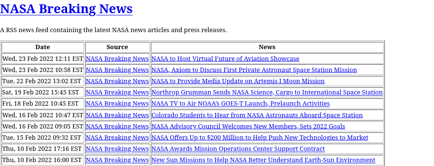
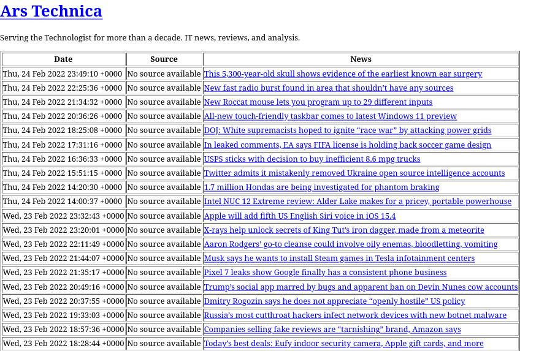

# Java Software Development Projects

This repository contains 10 comprehensive Java projects demonstrating fundamental computer science concepts, data structures, algorithms, and software engineering principles.

## Project Overview

### Project #1 - WordCounter
**Purpose**: Text analysis program that counts word occurrences in text files and generates HTML reports.
- Reads text files and parses words (excluding separators).
- Counts word frequencies.
- Outputs formatted HTML table with alphabetical word listing.

### Project #2 - NaturalNumberOnString
**Purpose**: Custom data structure for representing natural numbers using string-based storage.
- String-based representation of non-negative integers.
- Proper handling of mathematical natural number concepts.

### Project #3 - MapWithHashing
**Purpose**: Hash table implementation using separate chaining for collision resolution.
- Key-value map using array of buckets.
- Hash functions for efficient distribution.
- Separate chaining collision handling.

### Project #4 - SetOnBST
**Purpose**: Set data structure implementation using Binary Search Trees.
- Maintains collection of unique elements.
- Efficient insertion, deletion, and lookup operations.
- Leverages BST ordering for comparable elements.

### Project #5 - SortingMachineWithHeapsort
**Purpose**: Sorting machine implementation using heap sort algorithm.
- Two-mode operation: insertion and extraction.
- Internal heap data structure for efficient sorting.
- Elements can be added in insertion mode, retrieved sorted in extraction mode.

### Project #6 - ListWithRetreat
**Purpose**: Doubly-linked list with cursor/position functionality.
- Maintains left and right list parts.
- Forward/backward cursor movement.
- Special "retreat" operation for backward navigation.

### Project #7 - ProgramAndStatement
**Purpose**: Abstract Syntax Tree representation for BL (Bugs Language) programming language.
- `Program2`: Represents complete programs with context and body.
- `Statement2`: Represents individual statements (IF, WHILE, CALL, BLOCK).
- Tree-based structure for language constructs.

### Project #8 - BLParser
**Purpose**: Parser for BL (Bugs Language) programming language.
- Converts tokenized input to abstract syntax trees.
- Syntax validation and error reporting.
- Handles instructions, conditionals, loops, and other language constructs.

### Project #9 - TagCloudGenerator
**Purpose**: Generates HTML tag clouds from text file analysis.
- Counts word frequencies in text files.
- Selects top N most frequent words.
- Creates styled HTML with font sizes proportional to frequency.
- Words displayed in alphabetical order with CSS styling.

#### Sample Tag Cloud Outputs

**Alice in Wonderland Analysis:**

**The Importance of Being Earnest Analysis:**

### Project #10 - TagCloud
**Purpose**: Alternative tag cloud generator using standard Java collections.
- Uses HashMap, PriorityQueue, and other built-in Java structures.
- Similar functionality to Project #9 with different implementation approach.
- Enhanced error handling for file operations.

### HomePage
**Purpose**: Personal homepage with portfolio and contact information.
- HTML-based static website.
- CSS styling with responsive design.
- Portfolio showcase with project demonstrations.

### NaturalNumberCalculator
**Purpose**: GUI-based calculator for natural number operations.
- Model-View-Controller architecture implementation.
- Interactive calculator interface for natural number computations.
- Demonstrates event-driven programming principles.

### NaturalNumberRoot
**Purpose**: Computes natural number roots using Newton's method.
- Iterative root-finding algorithm implementation.
- Precision-controlled computation for natural numbers.
- Mathematical algorithm demonstration.

### Newton
**Purpose**: Implementation of Newton's method for various mathematical computations.
- Multiple versions demonstrating iterative improvement.
- Root-finding and optimization algorithms.
- Numerical method implementations with error analysis.

### Pseudoscience
**Purpose**: Mathematical constant approximation using de Jager's formula.
- ABCD guesser implementations for mathematical constants.
- Demonstrates computational approximation techniques.
- Statistical analysis of approximation accuracy.

### RSSAggregator
**Purpose**: RSS feed aggregator that processes and displays news feeds from multiple sources.
- Aggregates RSS feeds from various news sources (New York Times, Yahoo News, Ars Technica, NASA, OSU, Packet Storm).
- XML parsing for RSS feed processing with robust error handling.
- HTML generation for aggregated content display with styled output.
- Creates organized index pages with feed summaries and article links.
- Demonstrates web scraping, XML processing, and content aggregation techniques.
- Includes sample feeds and generated HTML output files.

#### Sample RSS Aggregator Outputs

### RSSReader
**Purpose**: RSS feed reader with XML processing capabilities.
- Parses RSS feeds from various news sources.
- Converts XML data to structured HTML output.
- Demonstrates XML processing and web content handling.

### StringReassemblyFromFragments
**Purpose**: Reconstructs original strings from overlapping fragments.
- String processing and pattern matching algorithms.
- Fragment overlap detection and assembly.
- Demonstrates greedy algorithm applications.

### XMLTreeExpressionEvaluator
**Purpose**: Evaluates mathematical expressions stored in XML format.
- XML tree parsing and traversal.
- Mathematical expression evaluation.
- Supports both integer and natural number expressions.

## Technical Highlights

### Data Structures Implemented
- **Hash Tables** with collision resolution.
- **Binary Search Trees** for ordered sets.
- **Heaps** for priority-based sorting.
- **Doubly-Linked Lists** with cursor navigation.
- **Abstract Syntax Trees** for language representation.

### Algorithms Demonstrated
- **Heap Sort** for efficient sorting operations.
- **Hash Functions** for data distribution.
- **Tree Traversal** for BST operations.
- **Text Parsing** for language processing.
- **Frequency Analysis** for text statistics.

### Software Engineering Concepts
- **Component-Based Design** with clear interfaces.
- **Abstract Data Types** with proper encapsulation.
- **Test-Driven Development** with comprehensive test suites.
- **Documentation** with detailed specifications.
- **Error Handling** and input validation.

## Project Structure

Each project follows a consistent structure:
- `src/` - Source code files.
- `test/` - JUnit test files.
- `doc/` - PDF specifications and documentation.
- `data/` - Sample input files and test data.
- `bin/` - Compiled class files.
- `lib/` - External libraries (if needed).
